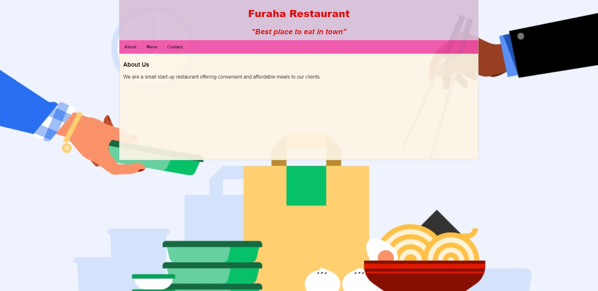

# Restaurant

> A simple Javascript page to unleash DOM and unpack webpack ...




## Built With

- HTML5
- CSS3
- Javascript


## Others

- Node.js
- Webpack


## Live Demo

[Live Demo Link](https://raw.githack.com/paulo-techie/restaurant/feature-webpack/index.html)


### How to use

To get a local copy up and running follow these simple steps:

Clone or download https://github.com/paulo-techie/restaurant files to your working folder

In your working folder open Terminal and run the following commands:
```
cd restaurant 
```
```
npm install
```
```
npm start
```
```
cd dist
```
```
open index.html
```


## Author

👤 Paul Omondi

- Github: [@paulo-techie](https://github.com/paulo-techie)
- Linkedin: [@paulo-techie](https://www.linkedin.com/in/paulo-techie/)


## 🤝 Contributing

Contributions, issues and feature requests are welcome!

Feel free to check the [issues page](../../issues/).


## Show your support

Give a ⭐️ if you like this project!


## Acknowledgments

- Hat tip to anyone whose code was used
- Inspiration
- etc


## 📝 License

This project is  [MIT](./MIT.md) licensed.
